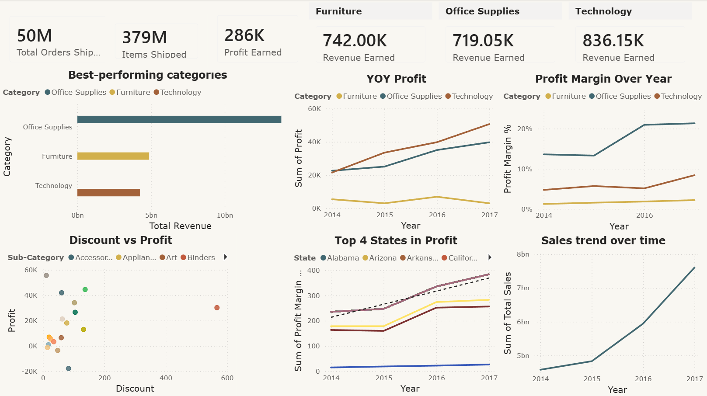
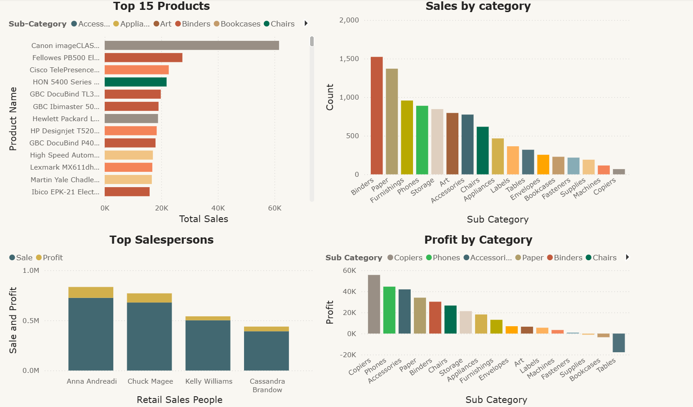

# 📊 Retail Supply Chain Analytics Dashboard 

## 🧠 Problem Statement

Retail businesses often generate large amounts of transactional, product, customer, and shipping data, but decision-makers may struggle to identify which areas are driving profit and which areas are causing operational inefficiencies.

This project addresses the need for a centralized Power BI dashboard that helps stakeholders answer key business questions:

- Which categories and products generate the most revenue?
- Which products or sub-categories are reducing profitability?
- How do discounts affect profit?
- Which regions and salespeople perform best?
- How efficient is the shipping process?
- What operational issues should the company prioritize?

---

## 📁 Dataset

- **Data Type:** Retail sales and supply chain transaction data
- **Records:** Approximately 180K+ transaction records
- **Format Used:** Excel / CSV

### Dataset Features

The dataset includes:

- Order details
- Shipping details
- Customer information
- Product categories and sub-categories
- Sales, quantity, discount, and profit
- Regional and geographical data
- Return status
- Delivery and shipping performance fields

---

## 🛠️ Tools & Technologies

- **Power BI** – Dashboard development and visualization
- **Power Query** – Data cleaning and transformation
- **DAX** – Measures, KPIs, and calculations
- **Excel** – Dataset handling and preparation
- **GitHub** – Project documentation and portfolio presentation

---

## 📊 Dashboard Preview

### Executive Overview



### Product & Sales Analysis



### Operations & Logistics


---

## 📊 Dashboard Structure

### 1. Executive Overview

This page provides a high-level summary of company performance.

Key visuals include:

- Total Revenue
- Total Profit
- Total Orders
- Units Sold
- Average Shipping Days
- Sales Trend by Year
- Revenue by Category
- Profit Growth by Category
- Delivery Performance

---

### 2. Product & Sales Analysis

This page focuses on product-level and salesperson-level performance.

Key visuals include:

- Top 15 Products by Revenue
- Sales by Sub-Category
- Profit by Sub-Category
- Salesperson Performance
- Product profitability comparison

---

### 3. Operations & Profitability Drivers

This page analyzes operational efficiency and profitability drivers.

Key visuals include:

- Discount vs Profit Analysis
- Delivery Performance
- Shipping Mode Distribution
- Regional Profit Contribution
- Decomposition Tree for Profit Drivers
- Return Analysis by Category

---

## 📌 Key Metrics

The dashboard tracks the following business KPIs:

- Total Sales
- Total Profit
- Total Orders
- Total Quantity Sold
- Profit Margin %
- Return Rate %
- Average Shipping Days
- Average Discount
- Revenue by Category
- Profit by Region
- Sales by Sub-Category

---

## 📌 Key DAX Measures

```DAX
Total Sales = SUM(Data[Sales])
```

```DAX
Total Profit = SUM(Data[Profit])
```

```DAX
Total Orders = DISTINCTCOUNT(Data[Order ID])
```

```DAX
Total Quantity Sold = SUM(Data[Quantity])
```

```DAX
Profit Margin % = DIVIDE([Total Profit], [Total Sales], 0)
```

```DAX
Returned Orders =
CALCULATE(
    COUNTROWS(Data),
    Data[Returned] = "Yes"
)
```

```DAX
Return Rate % = DIVIDE([Returned Orders], [Total Orders], 0)
```

```DAX
Average Discount = AVERAGE(Data[Discount])
```

```DAX
Average Shipping Days = AVERAGE(Data[Shipping Days])
```

---

## 🔍 Key Insights

### 1. Revenue Growth

Revenue shows consistent growth from 2014 to 2017, indicating strong business expansion over time.

### 2. Category Performance

Office Supplies contributes the highest overall revenue, making it the strongest category by sales volume.

### 3. Profitability Trends

Technology shows strong profit growth, while Furniture produces weaker margins compared to other categories.

### 4. Loss-Making Products

Some sub-categories, such as Tables, generate negative profit and reduce overall profitability.

### 5. Shipping Dependency

Standard Class shipping accounts for the majority of shipments, showing a heavy dependency on slower shipping methods.

### 6. Delivery Performance Issue

Only around 65% of deliveries are on time, which indicates an opportunity to improve logistics and customer satisfaction.

### 7. Discounting Impact

Discounts do not consistently lead to higher profit. Some discounted products perform well, while others contribute to margin loss.

### 8. Regional Performance

The West region contributes strongly to profit, while some regions underperform and require further analysis.

---

## ⚠️ Business Problems Identified

- Loss-making product categories reduce profitability
- Discount strategies are inconsistent
- On-time delivery performance needs improvement
- Heavy reliance on Standard Class shipping may impact customer experience
- Furniture category has weaker profitability
- Returns create hidden operational costs
- Regional performance is uneven
- Some products generate revenue but fail to contribute meaningful profit

---

## 💡 Recommendations

### 1. Optimize Product Portfolio

The company should review loss-making sub-categories, especially products with consistent negative profit.

Recommended actions:

- Reduce focus on low-margin or loss-making products
- Reprice or renegotiate costs for weak sub-categories
- Prioritize high-margin products such as Copiers, Phones, and Accessories
- Monitor product profitability regularly

Expected impact:

- Improved profit margin
- Reduced losses
- Better product-level decision-making

---

### 2. Improve Discount Strategy

Discounting should be based on profitability rather than only sales volume.

Recommended actions:

- Avoid deep discounts on low-margin products
- Use controlled discounts for high-margin items
- Track discount impact by category and sub-category
- Set discount limits for products with negative profit

Expected impact:

- Better margin control
- Reduced unnecessary profit loss
- More effective promotional strategy

---

### 3. Improve Delivery Performance

The company should focus on increasing the on-time delivery rate.

Recommended actions:

- Identify regions or states with frequent delays
- Improve warehouse processing times
- Optimize delivery routes
- Review carrier performance
- Set a target to increase on-time delivery from 65% to above 80%

Expected impact:

- Higher customer satisfaction
- Lower cancellation risk
- Improved operational efficiency

---

### 4. Rebalance Shipping Strategy

Standard Class dominates shipping, but over-reliance on slower shipping methods may affect customer experience.

Recommended actions:

- Promote faster shipping options for high-value orders
- Use Second Class or First Class for priority customers
- Analyze profit impact by shipping mode
- Offer faster shipping for profitable product categories

Expected impact:

- Improved delivery speed
- Better customer retention
- More strategic shipping cost management

---

### 5. Improve Sales Team Performance

Top-performing salespeople should be studied to identify successful sales behaviors.

Recommended actions:

- Analyze strategies used by high-performing salespeople
- Provide coaching for lower-performing team members
- Track sales and profit together, not sales alone
- Reward profitable sales performance

Expected impact:

- Improved sales productivity
- Better profit-focused sales culture
- More consistent team performance

---

### 6. Reduce Returns

Returns create additional costs and reduce net profitability.

Recommended actions:

- Identify categories with high return rates
- Improve product descriptions and product quality checks
- Investigate whether certain products are frequently returned
- Track return reasons if available in future datasets

Expected impact:

- Lower reverse logistics cost
- Higher customer satisfaction
- Improved net profit

---

### 7. Strengthen Regional Strategy

Some regions outperform others in revenue and profit.

Recommended actions:

- Replicate successful strategies from high-performing regions
- Investigate underperforming regions
- Adjust marketing and inventory strategies regionally
- Monitor profit by region instead of only sales

Expected impact:

- Better geographic performance
- Improved resource allocation
- Stronger regional growth

---

## 📈 Data Analyst Skills Demonstrated

This project demonstrates the following data analyst skills:

- Data cleaning and transformation using Power Query
- Data modeling and relationship building
- DAX measure creation
- KPI development
- Exploratory data analysis
- Dashboard design
- Business problem solving
- Data storytelling
- Insight generation
- Recommendation development

---

## 🔍 Analytical Thinking Demonstrated

This project shows the ability to:

- Translate business problems into analytical questions
- Identify profitability drivers
- Detect operational inefficiencies
- Compare revenue and profit performance
- Analyze category and product-level trends
- Investigate discount and shipping impact
- Recommend business actions based on data

---

## 📂 Project Structure

```text
Retail-Supply-Chain-Dashboard/
│
├── screenshots/
│   ├── overview.png
│   ├── product-analysis.png
│   └── operations.png
│
├── data/
│   └── Retail-Supply-Chain-Sales-Dataset.xlsx
│
├── dashboard/
│   └── Retail-Supply-Chain-Dashboard.pbix
│
└── README.md
```
## 📌 Future Improvements

Potential improvements for future versions:

- Add Power BI Service live dashboard link
- Add drill-through pages for product-level analysis
- Add tooltip pages for deeper insights
- Add forecasting for sales and profit
- Add customer segmentation analysis
- Add automated data refresh
- Add cloud-based ETL pipeline

---
